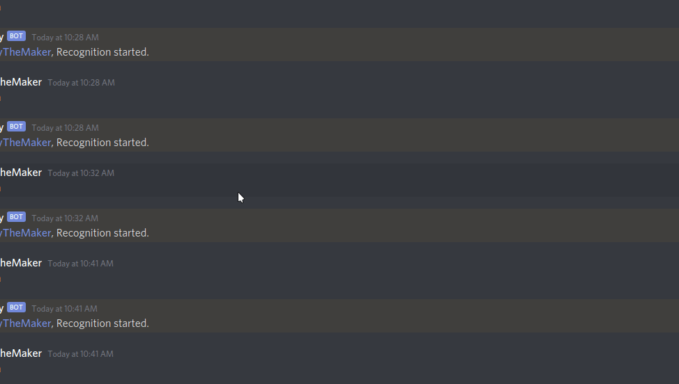
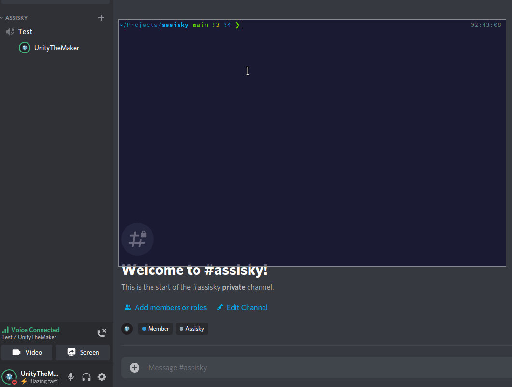

# assisky
A Discord Speech-to-Text module made with Vosk. Yes, it works!

## **IMPORTANT!**
In Discord settings, if you are not in the Push-to-Talk mode in "Voice & Video" and you are in the Voice Activity mode, you must disable "Automatically determine input sensivity" option and set it to lowest value. Like in this screenshot:
<br />



# Installation
1. Download a model. [You can click here to find models.](https://alphacephei.com/vosk/models)
2. Extract the zip file to a folder.
3. Rename the folder as "model" and put it in the root of your project or a path you want.
4. If you put the model folder at a custom path then edit the model path in the code.
5. Install ffmpeg. (``apt install ffmpeg`` for Ubuntu)
6. Install this npm module with ``npm i assisky``

# API
## Assisky.setup(options)
**options:**
```jsonc
{
    "voskLogLevel": int, // -1 to disable logging of Vosk
    "modelPath": "Path to downloaded model folder", // Default: ./model
}
```
Returns an event for sending recognition results. [See example for details.](./example/index.js)

## Assisky.startListeningUser(userId, discordVoiceConnection)
**userId**: A Discord user ID that joined to a voice channel.
<br />

**discordVoiceConnection**: The voice connection of the bot. (Bot should join the same VC with the user.) [See this for more details.](https://discordjs.guide/voice/)

## Assisky.stopListeningUser(userId)
**userId**: A Discord user ID that joined to a voice channel and recognition for user has been started and progressing.

## Assisky.stopListeningChannel(channelId)
**userId**: A Discord channel ID, bot will stop listening everyone in the channel. Useful to run before leaving a VC.

## Assisky.listeningList
Bot returns an Object which contains current listening users' streams, connection, userId. ``{discordAudio,PCMToMP3,wavReader,rec,connection,userId}``

## Assisky.config
The config object that recieved from Assisky.setup() function.

# Example
[Inspect the example folder.](./example/index.js)
<br />

**Note: In the example below, I've used the Turkish language model but you can use different models as you want.**
<br />
"bu bir denemedir" means "this is a test"
<br />
"merhaba dünya" means "hello world"

